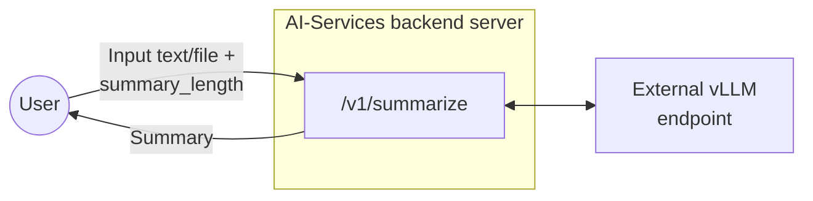
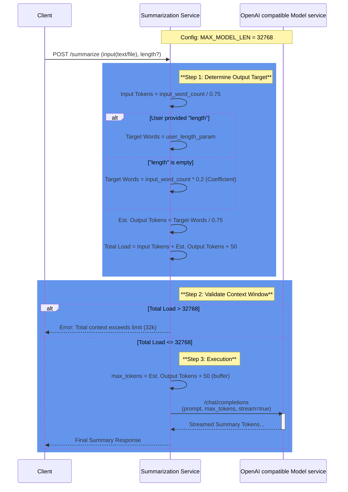

# Summarization Endpoint Design Document

## 1. Overview

This document describes the design and implementation of a summarization endpoint for backend server of AI-Services. The endpoint accepts text content in multiple formats (plain text, .txt files, or .pdf files) and returns AI-generated summaries of configurable length.

## 2. Endpoint Specification

### 2.1 Endpoint Details

| Property | Value                                   |
|----------|-----------------------------------------|
| HTTP Method | POST                                    |
| Endpoint Path | /v1/summarize                           |
| Content Type | multipart/form-data or application/json |

### 2.2 Request Parameters

| Parameter | Type | Required    | Description                                                                                        |
|--------|------|-------------|----------------------------------------------------------------------------------------------------|
| text | string | Conditional | Plain text content to summarize. Required if file is not provided.                                 |
| file | file | Conditional | File upload (.txt or .pdf). Required if text is not provided.                                      |
| length | integer | Conditional | Desired summary length in no. of words                                                             |
| stream | bool | Conditional | if true, stream the content value directly. Default value will be false if not explicitly provided |

### 2.3 Response Format

The endpoint returns a successful JSON response with the following structure:

| Field                  | Type | Description                                |
|------------------------|------|--------------------------------------------|
| data                   | object| Container for the response payload         |
| data.summary           | string | The generated summary text                 |
| data.original_length   | integer | Word count of original text                |
| data.summary_length    | integer | Word count of the generated summary        |
| meta                   | object | Metadata regarding the request processing. | 
| meta.model             | string | The AI model used for summarization        |
| meta.processing_time_ms | integer| Request processing time in milliseconds      |
| meta.input_type        |string| The type of input provided. Valid values: text, file.|
| usage                  | object | Token usage statistics for billing/quotas.|
| usage.input_tokens     | integer| Number of input tokens consumed.      |
| usage.output_tokens    | integer| Number of output tokens generated.        |
| usage.total_tokens     | integer| Total number of tokens used (input + output). |

Error response:

| Field         | Type | Description                     |
|---------------|------|---------------------------------|
| error         | object | Error response details
| error.code    | string | error code |
| error.message | string | error message |
| error.status  | integer | error status |
## 3. Architecture



## 4. Implementation Details

### 4.1 Environment Configuration

| Variable | Description | Example                                              |
|----------|-------------|------------------------------------------------------|
| OPENAI_BASE_URL | OpenAI-compatible API endpoint URL |  https://api.openai.com/v1   |
| MODEL_NAME | Model identifier | ibm-granite/granite-3.3-8b-instruct                  |
* Max file size for files will be decided as below, check 4.2.1

### 4.2.1 Max size of input text (only for English Language)

*Similar calculation will have to done for all languages to be supported

**Assumptions:**
- Context window for granite model on spyre in our current configuration is 32768 since MAX_MODEL_LEN=32768 when we run vllm.
- Token to word relationship for English: 1 token ≈ 0.75 words
- SUMMARIZATION_COEFFICIENT = 0.2. This would provide a 200-word summary from a 1000 word input. 
- (summary_length_in_words = input_length_in_words*DEFAULT_SUMMARIZATION_COEFFICIENT)

We need to account for:
- System prompt: ~30-50 tokens
- Output summary size: input_length_in_words*SUMMARIZATION_COEFFICIENT

**Calculations:**
- input_length_in_words/0.75 + 50 + (input_length_in_words/0.75)*SUMMARIZATION_COEFFICIENT < 32768
- => 1.6* input_length_in_words < 32718
- => input_length_in_words < 20449

- max_tokens calculation will also be made according to SUMMARIZATION_COEFFICIENT
- max_tokens = (input_length_in_words/0.75)*SUMMARIZATION_COEFFICIENT + 50 (buffer)

**Conclusion:** We can say that considering the above assumptions, our input tokens can be capped at 20.5k words. 
Initially we can keep the context length as configurable and let the file size be capped dynamically with above calculation.
This way we can handle future configurations and models with variable context length.

### 4.2.2 Sequence Diagram to explain above logic



### 4.2.3 Stretch goal: German language support
- Token to word relationship for German: 1 token ≈ 0.5 words
- Rest everything remains same

**Calculations:**
- input_length_in_words/0.5 + 50 + (input_length_in_words/0.5)*SUMMARIZATION_COEFFICIENT < 32768
- => 2.4* input_length_in_words < 32718
- => input_length_in_words < 13632

- max_tokens calculation will also be made according to SUMMARIZATION_COEFFICIENT
- max_tokens = (input_length_in_words/0.5)*SUMMARIZATION_COEFFICIENT + 50 (buffer)

### 4.3 Processing Logic

1. Validate that either text or file parameter is provided. If both are present, text will be prioritized.
2. Validate summary_length is smaller than the set upper limit.
3. If file is provided, validate file type (.txt or .pdf)
4. Extract text content based on input type. If file is pdf, use pypdfium2 to process and extract text.
5. Validate input text word count is smaller than the upper limit.
6. Build AI prompt with appropriate length constraints
7. Send request to AI endpoint
8. Parse AI response and format result
9. Return JSON response with summary and metadata

## 5. Rate Limiting

- Rate limiting for this endpoint will be done similar to how it's done for retrieve.backend_server currently
- Since we want to support only upto 32 connections to the vLLM at any given time, `max_concurrent_requests=32`,
- Use `concurrency_limiter = BoundedSemaphore(max_concurrent_requests)` and acquire a lock on it whenever we are serving a request.
- As soon as the response is returned, release the lock and return the semaphore back to the pool.

## 6. Use Cases and Examples

### 6.1 Use Case 1: Plain Text Summarization

**Request:**
```
curl -X POST http://localhost:5000/v1/summarize \
-H "Content-Type: application/json" \
-d '{"text": "Artificial intelligence has made significant progress in recent years...", "length": 25}'
```
**Response:**
200 OK 
```json
{
  "data": {
    "summary": "AI has advanced significantly through deep learning and large language models, impacting healthcare, finance, and transportation with both opportunities and ethical challenges.",
    "original_length": 250,
    "summary_length": 22
  },
  "meta": {
    "model": "ibm-granite/granite-3.3-8b-instruct",
    "processing_time_ms": 1245,
    "input_type": "text"
  },
  "usage": {
    "input_tokens": 385,
    "output_tokens": 62,
    "total_tokens": 447
  }
}
```

---

### 6.2 Use Case 2: TXT File Summarization

**Request:**
```
curl -X POST http://localhost:5000/v1/summarize \
  -F "file=@report.txt" \
  -F "length=50"
```

**Response:**
200 OK 
```json
{
  "data": {
    "summary": "The quarterly financial report shows revenue growth of 15% year-over-year, driven primarily by increased cloud services adoption. Operating expenses remained stable while profit margins improved by 3 percentage points. The company projects continued growth in the next quarter based on strong customer retention and new product launches.",
    "original_length": 351,
    "summary_length": 47
  },
  "meta": {
    "model": "ibm-granite/granite-3.3-8b-instruct",
    "processing_time_ms": 1245,
    "input_type": "file"
  },
  "usage": {
    "input_tokens": 468,
    "output_tokens": 62,
    "total_tokens": 530
  }
}

```

---

### 6.3 Use Case 3: PDF File Summarization

**Request:**
```
curl -X POST http://localhost:5000/v1/summarize \
  -F "file=@research_paper.pdf" 
```

**Response:**
200 OK 
```json
{
  "data": {
    "summary": "This research paper investigates the application of transformer-based neural networks in natural language processing tasks. The study presents a novel architecture that combines self-attention mechanisms with convolutional layers to improve processing efficiency. Experimental results demonstrate a 12% improvement in accuracy on standard benchmarks compared to baseline models. The paper also analyzes computational complexity and shows that the proposed architecture reduces training time by 30% while maintaining comparable performance. The authors conclude that hybrid approaches combining different neural network architectures show promise for future NLP applications, particularly in resource-constrained environments.",
    "original_length": 982,
    "summary_length": 89
  },
  "meta": {
    "model": "ibm-granite/granite-3.3-8b-instruct",
    "processing_time_ms": 1450,
    "input_type": "file"
  },
  "usage": {
    "input_tokens": 1309,
    "output_tokens": 120,
    "total_tokens": 1429
  }
}
```
### 6.4 Use Case 4: streaming summary output

**Request:**
```
curl -X POST http://localhost:5000/v1/summarize \
  -F "file=@research_paper.pdf" \
  -F "stream=True"
```
**Response:**
202 Accepted 
```
data: {"id":"chatcmpl-c0f017cf3dfd4105a01fa271300049fa","object":"chat.completion.chunk","created":1770715601,"model":"ibm-granite/granite-3.3-8b-instruct","choices":[{"index":0,"delta":{"role":"assistant","content":""},"logprobs":null,"finish_reason":null}],"prompt_token_ids":null}

data: {"id":"chatcmpl-c0f017cf3dfd4105a01fa271300049fa","object":"chat.completion.chunk","created":1770715601,"model":"ibm-granite/granite-3.3-8b-instruct","choices":[{"index":0,"delta":{"content":"The"},"logprobs":null,"finish_reason":null,"token_ids":null}]}

data: {"id":"chatcmpl-c0f017cf3dfd4105a01fa271300049fa","object":"chat.completion.chunk","created":1770715601,"model":"ibm-granite/granite-3.3-8b-instruct","choices":[{"index":0,"delta":{"content":"quar"},"logprobs":null,"finish_reason":null,"token_ids":null}]}

data: {"id":"chatcmpl-c0f017cf3dfd4105a01fa271300049fa","object":"chat.completion.chunk","created":1770715601,"model":"ibm-granite/granite-3.3-8b-instruct","choices":[{"index":0,"delta":{"content":"ter"},"logprobs":null,"finish_reason":null,"token_ids":null}]}

```

### 6.5 Error Case 1: Unsupported file type

**Request:**
```
curl -X POST http://localhost:5000/v1/summarize \
  -F "file=@research_paper.md" 
```
**Response:**
400 
```json
{
  "error": {
    "code": "UNSUPPORTED_FILE_TYPE",
    "message": "Only .txt and .pdf files are allowed.",
    "status": 400}
}
```
## 7.1 Successful Responses

| Status Code | Scenario                     |
|-------------|------------------------------|
| 200 | plaintext in json body       |
|200| pdf file in multipart form data |
| 200 | txt file in multipart form data |
|202 | streaming enabled            |

## 7.2 Error Responses

| Status Code | Error Scenario | Response Example                                                           |
|-------------|----------------|----------------------------------------------------------------------------|
| 400 | Missing both text and file | {"message": "Either 'text' or 'file' parameter is required"}               |
| 400 | Unsupported file type | {"message": "Unsupported file type. Only .txt and .pdf files are allowed"} |
| 413 | File too large | {"message": "File size exceeds maximum token limit"}                       |
| 500 | AI endpoint error | {"message": "Failed to generate summary. Please try again later"}          |
| 503 | AI services unavailable | {"message": "Summarization service temporarily unavailable"}               |


## 8. Test Cases

| Test Case | Input | Expected Result |
|-----------|-------|-----------------|
| Valid plain text, short | text + length=50 | 200 OK with short summary |
| Valid .txt file, medium | .txt file + length=200 | 200 OK with medium summary |
| Valid .pdf file, long | .pdf file + length=500 | 200 OK with long summary |
| Missing parameters | No text or file | 400 Bad Request |
| Invalid file type | .docx file | 400 Bad Request |
| File too large | 15MB file | 413 Payload Too Large |
| Invalid summary_length | length="long" | 400 Bad Request |
| AI service timeout | Valid input + timeout | 500 Internal Server Error |

## 9. Summary Length Configuration Proposal for UI

1. Word count limit hiding behind understandable identifier words like – short, medium, long

| Length Option | Target Words | Instruction                                                     |
|---------------|--------------|-----------------------------------------------------------------|
| short         | 50-100       | Provide a brief summary in 2-3 sentences                        |
| medium        | 150-250      | Provide a comprehensive summary in 1-2 paragraphs               |
| long          | 300-500      | Provide a detailed summary covering all key points              |
| extra long    | 800-1000     | Provide a complete and detailed summary covering all key points |
